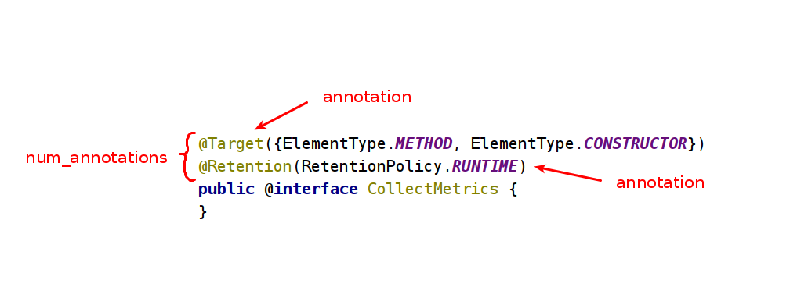
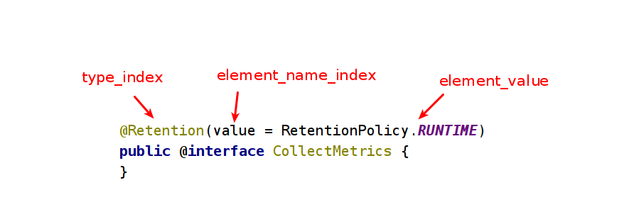

# RuntimeVisibleAnnotations

The `RuntimeVisibleAnnotations` attribute is a variable-length attribute in the `attributes` table of a `ClassFile` , `field_info` , or `method_info` structure<sub>注：这里是说明位置信息</sub>. The `RuntimeVisibleAnnotations` attribute records run-time visible annotations on the declaration of the corresponding class, field, or method.<sub>注：这里是说明作用</sub>

There may be at most one<sub>注：这里是对数量的限制</sub> `RuntimeVisibleAnnotations` attribute in the `attributes` table of a `ClassFile` , `field_info` , or `method_info` structure.

The `RuntimeVisibleAnnotations` attribute has the following format:

```txt
RuntimeVisibleAnnotations_attribute {
    u2         attribute_name_index;
    u4         attribute_length;
    u2         num_annotations;
    annotation annotations[num_annotations];
}
```



The `annotation` structure has the following format:

```txt
annotation {
    u2 type_index;
    u2 num_element_value_pairs;
    {
        u2            element_name_index;
        element_value value;
    } element_value_pairs[num_element_value_pairs];
}
```



- type_index

The value of the `type_index` item must be a valid index into the `constant_pool` table. The `constant_pool` entry at that index must be
a `CONSTANT_Utf8_info` structure representing **a field descriptor**. **The field descriptor** denotes **the type of the annotation**<sub>注：这里就是注解类，`Ljava/lang/annotation/Target;` 是这种形式的值</sub> represented by this annotation structure.

- element_name_index

The value of the `element_name_index` item must be a valid index into the `constant_pool` table. The `constant_pool` entry at that index must be a `CONSTANT_Utf8_info` structure. The `constant_pool` entry denotes the name of the element of the element-value pair represented by this `element_value_pairs` entry.

In other words, the entry denotes an element of the annotation type specified by `type_index`.

The `element_value` structure is a discriminated union representing the value of an element-value pair. It has the following format:

```txt
element_value {
    u1 tag;
    union {
        u2 const_value_index;

        {
            u2 type_name_index;
            u2 const_name_index;
        } enum_const_value;

        u2 class_info_index;

        annotation annotation_value;
        {
            u2            num_values;
            element_value values[num_values];
        } array_value;
    } value;
}
```

The `tag` item uses a single ASCII character to indicate the type of the value of the `element-value` pair. This determines which item of the `value` union is in use.

Interpretation of `tag` values as types

| tag  | Type            | value             | Constant Type    |
| ---- | --------------- | ----------------- | ---------------- |
| `B`  | byte            | const_value_index | CONSTANT_Integer |
| `C`  | char            | const_value_index | CONSTANT_Integer |
| `D`  | double          | const_value_index | CONSTANT_Double  |
| `F`  | float           | const_value_index | CONSTANT_Float   |
| `I`  | int             | const_value_index | CONSTANT_Integer |
| `J`  | long            | const_value_index | CONSTANT_Long    |
| `S`  | short           | const_value_index | CONSTANT_Integer |
| `Z`  | boolean         | const_value_index | CONSTANT_Integer |
| `s`  | String          | const_value_index | CONSTANT_Utf8    |
| `e`  | Enum type       | enum_const_value  | Not applicable   |
| `c`  | Class           | class_info_index  | Not applicable   |
| `@`  | Annotation type | annotation_value  | Not applicable   |
| `[`  | Array type      | array_value       | Not applicable   |

## Example

一个示例，就是`java.lang.Runnable`

```java
@FunctionalInterface
public interface Runnable {
    public abstract void run();
}
```

这应该是一个简单的形式

```java
@Deprecated
public class HelloWorld {
    // nothing
}
```

```java
@Target({ElementType.METHOD, ElementType.CONSTRUCTOR})
@Retention(RetentionPolicy.RUNTIME)
public @interface CollectMetrics {
}
```

```txt
RuntimeInvisibleAnnotations:
HexCode: 00060000002000020007000100085b0002650009000a650009000b000c0001000865000d000e
attribute_name_index='0006' (6) // |006| CONSTANT_Utf8 {Value='RuntimeVisibleAnnotations'
attribute_length='00000020' (32)
num_annotations='0002' (2)
type_index='0007' (7) // |007| CONSTANT_Utf8 {Value='Ljava/lang/annotation/Target;'
num_element_value_pairs='0001' (1)
element_name_index='0008' (8) // |008| CONSTANT_Utf8 {Value='value'
tag='5b' ([)
num_values='0002' (2)
tag='65' (e)
type_name_index='0009' (9) // |009| CONSTANT_Utf8 {Value='Ljava/lang/annotation/ElementType;'
const_name_index='000a' (10) // |010| CONSTANT_Utf8 {Value='METHOD'
tag='65' (e)
type_name_index='0009' (9) // |009| CONSTANT_Utf8 {Value='Ljava/lang/annotation/ElementType;'
const_name_index='000b' (11) // |011| CONSTANT_Utf8 {Value='CONSTRUCTOR'
type_index='000c' (12) // |012| CONSTANT_Utf8 {Value='Ljava/lang/annotation/Retention;'
num_element_value_pairs='0001' (1)
element_name_index='0008' (8) // |008| CONSTANT_Utf8 {Value='value'
tag='65' (e)
type_name_index='000d' (13) // |013| CONSTANT_Utf8 {Value='Ljava/lang/annotation/RetentionPolicy;'
const_name_index='000e' (14) // |014| CONSTANT_Utf8 {Value='RUNTIME'
```

